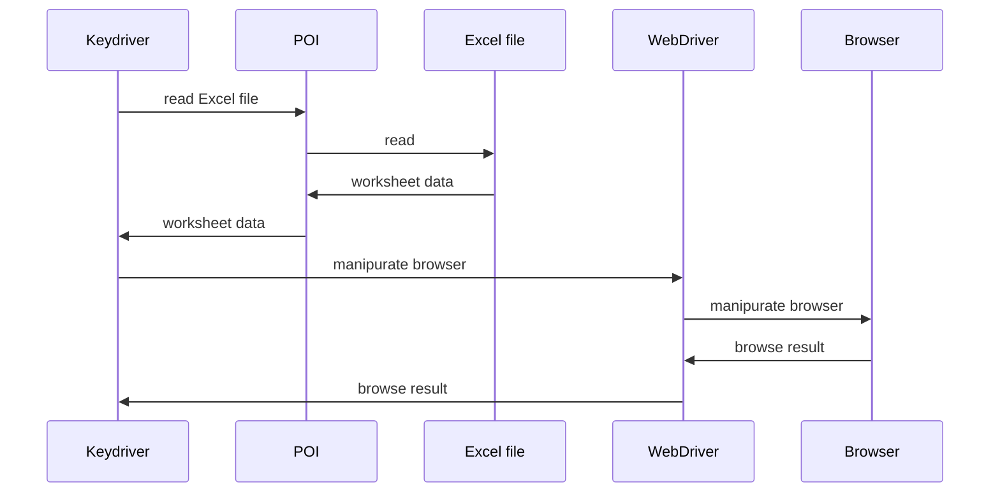

Keydriver
====

Keyword driven "like" testing tool.



# How to use

1. Install WebDriver executable
2. Build executable jar
3. Write ```.xlsx``` file for test directives.
4. Run executable jar file

## Instell WebDriver executable

ex.
```
brew install --cask chromedriver
```

## Build executable jar

```
mvn package
```

## Write ```.xlsx``` file for test directives.

see [FileFormat](doc/FileFormat.md)

## Run Keydriver jar file

```
java -jar keydriver-<version>.jar <test_directive>.xlsx
```

# Configuration

see [Config](doc/Config.md)

# ToDo

- Output standard test result
- More util tests
- Dynamic loading JDBC driver jar
- Dynamic loading ```config.properties```
